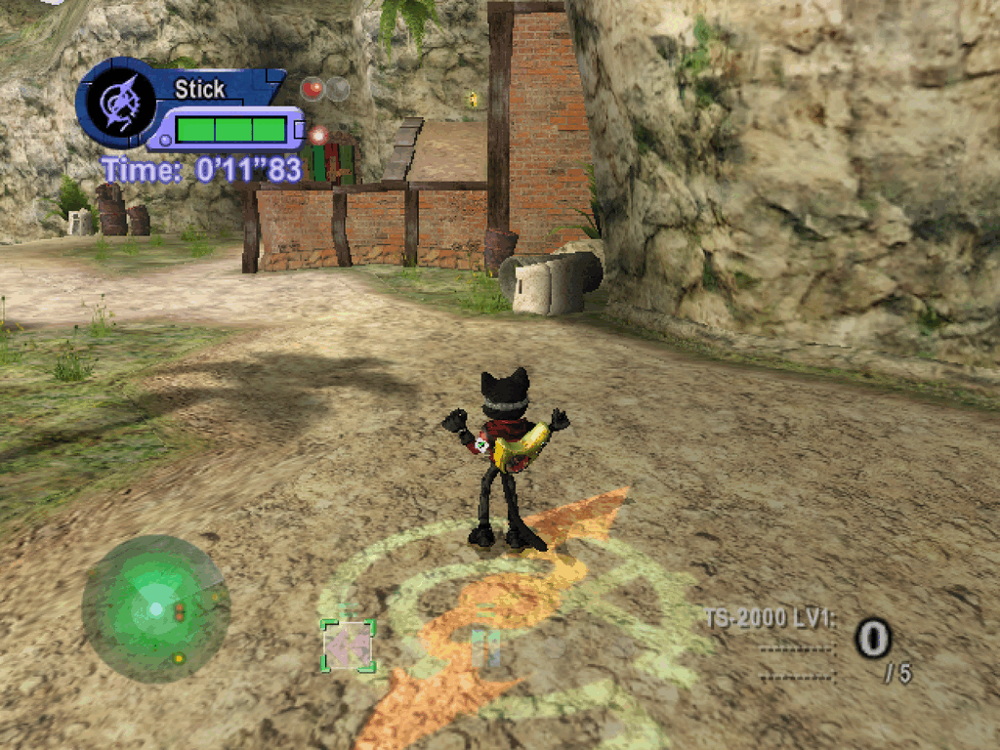
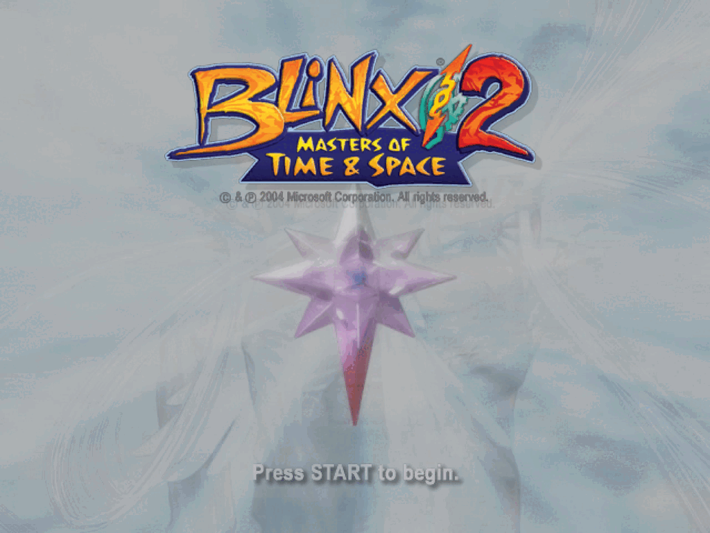
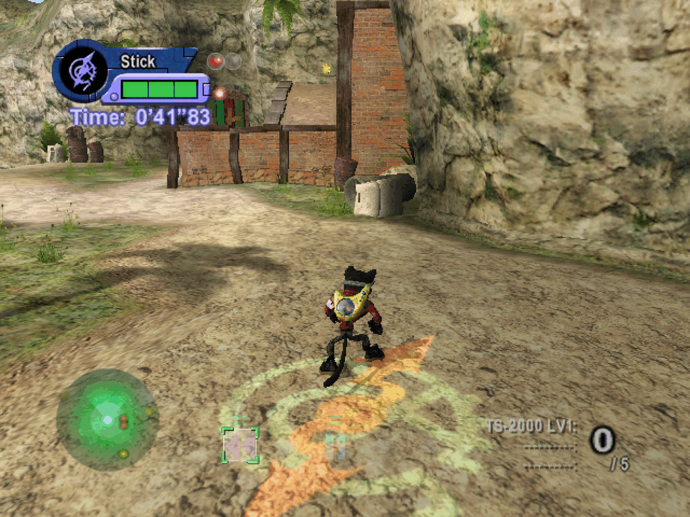
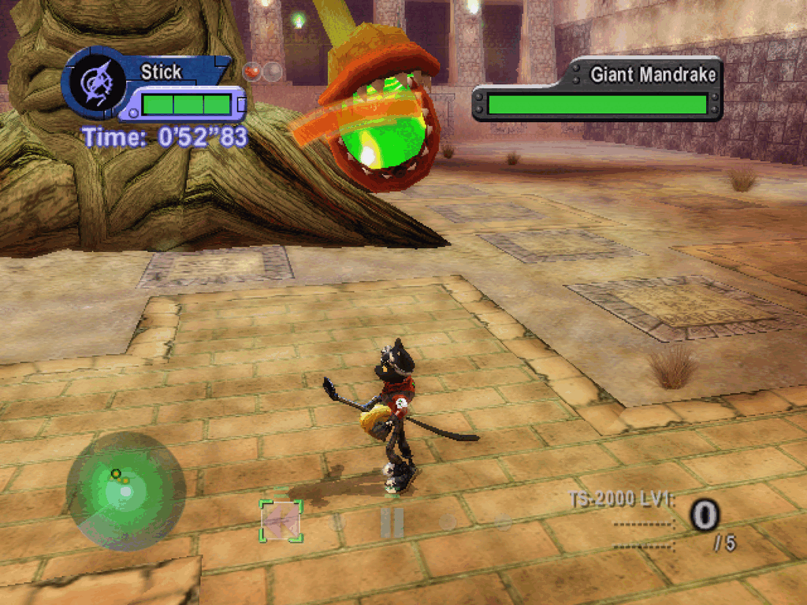
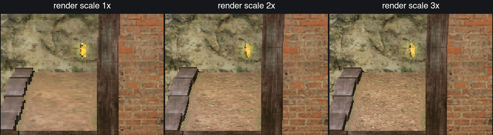

# BLiNX 2 static recompilation

A static recompilation of the original Xbox game *BLiNX 2: Masters of Time &
Space* to native PC code. The game's x86 code in `default.xbe` is lifted to C
by the [xboxrecomp](https://github.com/apexJCL/xboxrecomp) toolkit and compiled
together with a host runtime: a replacement Xbox kernel, NV2A (GPU) pushbuffer
execution and APU/audio pieces.

**Status:** runs with sound, controllers and saves on macOS (Apple silicon,
Metal) and on Linux under Proton (Direct3D 11, the Windows build), the Steam
Deck included | stage 1 is
checked on every build; every later stage and boss has been reached in
scripted runs | one command builds a private, installable bundle (macOS app,
Windows setup program, SteamOS installer) | **no game data included: bring
your own copy**



<!-- TODO(link): releases page, once a release exists -->
<!-- TODO(link): demo video -->

## Screenshots







<!-- TODO(screenshot): second boss fight or time-control effect -->
<!--  -->

<!-- TODO(screenshot): attract mode -->
<!--  -->

<!-- TODO(screenshot): macOS, Metal backend in an SDL2 window -->
<!--  -->

<!-- TODO(gif): short gameplay clip -->
<!--  -->

### Render scale

The optional enhancements layer can render the 3D at a multiple of the stock
640x480 (`render.scale` in `enhance.toml`, or `RECOMP_RENDER_SCALE`, 1 to 4;
Metal and Direct3D 11). The grid shows the same detail of stage 1 at 1x, 2x and
3x, taken from the Metal backend in a window at twice the stock size. Stock
behaviour, and the golden checks, stay at 1x.



## What this is

This repository holds the game-specific half of the project: the boot code,
hand-written replacements for a few XDK library functions, scripts for the
pipeline, benchmarks and golden-frame checks, and the design notes. The
generic half (the lifter and the host runtime) is the xboxrecomp toolkit.

<!-- TODO(diagram): architecture, default.xbe -> toolkit analysis/lift -> generated C -> compiled with host runtime (kernel, NV2A, APU) -> native binary -->
<!--  -->

The toolkit is a fork, [apexJCL/xboxrecomp](https://github.com/apexJCL/xboxrecomp),
of [sp00nznet/xboxrecomp](https://github.com/sp00nznet/xboxrecomp). This
project needs changes that are only in the fork, so it builds against
apexJCL/xboxrecomp, not upstream.

## Current status

| Platform | Render backend | Status |
|---|---|---|
| Windows / Linux (Proton) | Direct3D 11 (DXVK under Proton) | Runs with audio (XAudio2, FAudio under Proton), controllers and the keyboard. The tested route is a Windows x86-64 build run under Proton, on a Linux desktop and on the Steam Deck (SteamOS); native Windows is untested. |
| macOS (Apple silicon) | Metal, shown in an SDL2 window | Runs with audio (SDL2), controllers (SDL2 GameController) and the keyboard. |

Both routes pass the same automated checks on every build: the attract mode,
stage 1 and the story route up to the hub are compared frame by frame against
reference frames (`analysis/golden/golden.json`, `blinx2 bench golden`). Every
other stage and boss has been reached, through the game's own stage select,
in scripted runs on Metal (`scripts/shots/`).

What works today, and what does not yet:

- **Rendering:** Metal and Direct3D 11 render the game; the CPU rasteriser is a
  slow reference path. Known gaps: bump-environment mapping (texture mode 6)
  samples as a plain 2D texture, which affects the stage 1 ocean and the
  Boss 3 ripple; user clip planes are honoured on the CPU path only; a few
  boss-stage artefacts (sky wedges in Boss 1, shadow shapes in two later
  bosses) are the same on every backend and are still being checked against
  the original hardware.
- **Threads:** the Xbox has one CPU, and the game relies on it: two of its
  threads add stage lights to one list without a lock, and on a multi-core
  PC they could lose entries, which left the ground and water unlit (dark
  water under Proton). The runtime now runs the game's threads on one host
  core, as on the Xbox (`RECOMP_GUEST_CPUS=all` turns this off). macOS has
  no way to pin a thread to a core, so there the race is still possible,
  although the Metal checks have not shown it.
- **Audio:** on by default on every platform (`RECOMP_AC97_READY`).
- **Input:** controllers work as player 1 on every platform, and so does
  the keyboard (`RECOMP_KEYBOARD=1`, on by default in the Windows, SteamOS
  and macOS bundles; the keys are in each bundle's README.txt). On macOS,
  connect the controller before starting the game: hot-plugging is not
  handled.
- **Saves:** saving and loading work. A bundle keeps them in its `hdd/`
  folder, outside the program files (see
  [docs/packaging.md](docs/packaging.md)); a development build uses the
  toolkit's default save root unless `RECOMP_HDD_DIR` points elsewhere.
- **Movies (FMV):** the game's own Sofdec decoder runs; the runtime shows
  its frames. Audio-to-video drift has not been measured.
- **Frame rate:** 30 frames per second, as on the Xbox. A 60 fps mode is not
  planned: the game's stage logic steps a fixed 1/30 s, so a faster frame
  rate would play at double speed.
- **Enhancements (opt-in, off by default):** `render.scale` 1 to 4 (Metal
  and Direct3D 11), `present.filter` (`nearest`, `linear`, `integer`),
  `present.fullscreen` and `present.pacing`, read from `enhance.toml` next to
  the executable (in a bundle: `config/enhance.toml` in its data folder, see
  [docs/packaging.md](docs/packaging.md)) or from the matching `RECOMP_*`
  variables. On the Steam Deck in Gaming Mode, set the game's Steam
  properties to the native resolution (1280x800): with the default, the
  game gets a 1920x1080 screen and fullscreen ends up with bars on all four
  sides.
  `present.pacing = "sleep"` lets the game's frame wait sleep until the next
  vblank instead of spinning on a CPU core as the Xbox does: less heat and
  battery on a laptop or a Steam Deck, the same frames. `fps.mode` accepts
  only `lock30`; `lock60` and `free` say they are not available, for the
  reason under Frame rate above. Widescreen (Hor+) is not
  implemented. Checked on Metal and on Direct3D 11 under Proton; resizing
  the Direct3D 11 window under Proton does not reach the game on the tested
  desktop (GE-Proton 11, KWin), while fullscreen and render scale do.
- **Known hang:** the game can freeze on the results screen at the end of
  mission 1 and after the mission 3 boss (seen on macOS and on the Steam
  Deck). A fix is being tested: a build with it cleared mission 3 on the
  Steam Deck.
- **Known crash:** one scripted run on macOS crashed in stage 5-1 after
  about 90 s; it is being investigated.

The open work is tracked under `openspec/changes/`.

## Requirements

### Before you start

- [ ] Your own legally obtained copy of BLiNX 2: a dump of the disc, meaning
  `default.xbe` plus the rest of the game's files. This project does not
  provide or link to them.
- [ ] The game files placed in `game_files/` (git ignores it).
- [ ] Python 3.9 or newer, [uv](https://docs.astral.sh/uv/getting-started/installation/)
  (macOS: `brew install uv`; Linux: `curl -LsSf https://astral.sh/uv/install.sh | sh`;
  Windows: `winget install --id=astral-sh.uv -e`) and git. `./blinx2 setup`
  fetches the rest (CMake, Ninja, the Python packages from the committed
  `uv.lock`, llvm-mingw and the toolkit fork at its pinned commit), checking
  each download against a pinned sha256.
- [ ] The platform tools below.

### Per platform

No minimum versions have been established; the "tested" entries are the versions
listed under [Tested with](#tested-with).

| Platform | OS | Toolchain | Dependencies | GPU backend | Status |
|---|---|---|---|---|---|
| macOS (Apple silicon) | tested: macOS 27.0 | Xcode Command Line Tools (tested: 27.0, Apple clang 21.0.0), CMake (tested: 4.4.3) | SDL2, OpenSSL (Homebrew; tested: sdl2-compat 2.32.72, OpenSSL 3.6.5), Python (tested: 3.14.8) | Metal | Runs with audio, controllers and keyboard |
| Windows x86-64 (native) | not tested | [llvm-mingw](https://github.com/mstorsjo/llvm-mingw) (clang + lld + mingw-w64, UCRT), CMake, Ninja (cross-compiled) | - | Direct3D 11 | Builds with llvm-mingw; tested only under Proton |
| Linux (Proton) | tested: Fedora 44-based, kernel 7.2 | Same Windows build, cross-compiled with llvm-mingw (tested: 20260922, clang 23.1.2) | Proton via `umu-run` (tested: GE-Proton11-7, umu-launcher 1.4.4) | Direct3D 11 via DXVK | Runs with audio, controllers and keyboard |

The pipeline and the Windows cross-build run on macOS, Linux or Windows
(building on a Windows host is untested). The macOS build needs a Mac.

## Tested with

| Platform | OS | Toolchain | Key dependencies | GPU / driver | Backend |
|---|---|---|---|---|---|
| macOS (Apple silicon) | macOS 27.0 (arm64) | Apple clang 21.0.0 (Command Line Tools 27.0), CMake 4.4.3, Ninja 1.13.2 | sdl2-compat 2.32.72, OpenSSL 3.6.5, Python 3.14.8 | Apple Silicon (M4) | Metal |
| Linux (Proton) | Fedora 44-based, kernel 7.2 (x86-64) | llvm-mingw 20260922 (clang 23.1.2), CMake 3.31.11, Ninja 1.12.1 (in a Fedora 42 container) | GE-Proton11-7 via umu-launcher 1.4.4, DXVK 3.1 (as bundled) | NVIDIA GeForce RTX 2060, NVIDIA proprietary driver 615.71 (Vulkan 1.4) | Direct3D 11 (DXVK) |
| Windows (native) | not tested | llvm-mingw | - | - | Direct3D 11 |

## Getting started

The layout used below:

```
cat/                 this repository
cat/game_files/      your disc dump: default.xbe and the game's files
```

One command-line tool, `blinx2`, runs every step on macOS, Linux and
Windows. `blinx2.py` is a standard-library bootstrap that runs
[xboxrecomp-cli](https://github.com/apexJCL/xboxrecomp-cli) at the commit
`game.toml` pins (see "The CLI" below). To get a game you can install, run
one command:

```sh
./blinx2             # Windows: blinx2 (the blinx2.cmd wrapper)
```

It fetches the toolchain the first time, generates and builds whatever is
missing or out of date, and leaves a private bundle for this computer in
`dist/` (see [Install on your own machines](#install-on-your-own-machines)).
`./blinx2 package windows|steamos|macos` does the same for another target,
and `./blinx2 doctor` shows what this machine has and what it can package.
A cold run takes about 20 to 25 minutes; the next ones only rebuild.

**Developing the recomp itself** uses the separate steps:

```sh
./blinx2 setup       # once: .venv, llvm-mingw, the toolkit; ends with doctor
./blinx2 analyze     # parse the XBE, find functions, classify, recover ABIs
./blinx2 recomp      # lift to C: src/recomp/gen/
./blinx2 build       # macOS: build/cat_recomp; elsewhere: build-win/cat_recomp.exe
```

The Python tests and the lint run from the locked dev environment
(`pyproject.toml`, `uv.lock`):

```sh
uv run pytest scripts
uv run ruff check . && uv run ruff format --check .
git config blame.ignoreRevsFile .git-blame-ignore-revs   # skip the one ruff format commit
```

`./blinx2 <command> --help` lists the options. The optional `ghidra` stage
(slow, cached) only improves function names; it needs Ghidra
(`GHIDRA_HOME`) and a Python 3.13 venv with PyGhidra at `.venv-ghidra`.
`package`
builds in its own `build-pkg-macos/` and `build-pkg-win/`, with the stock
options, so your `build/` and `build-win/` keep whatever options you set.

### The toolkit

`setup` clones the toolkit fork
([apexJCL/xboxrecomp](https://github.com/apexJCL/xboxrecomp), branch
`blinx2/portability`) at the commit pinned in `game.toml` into
`external/xboxrecomp`, unless one is already found. CMake, `blinx2` and
`blinx2 bench` look for it in this order:

1. `$XBOXRECOMP_DIR` (or `-DXBOXRECOMP_DIR=...` for CMake);
2. `external/xboxrecomp` inside this project;
3. `../xboxrecomp`, next to this project.

### The CLI

The commands themselves live in
[xboxrecomp-cli](https://github.com/apexJCL/xboxrecomp-cli), which any game
built on the toolkit can use. This project's `game.toml` describes BLiNX 2
to it: names, paths, pipeline flags, packaging and bench settings, and the
pins. `blinx2.py` runs the CLI at `game.toml`'s `[cli] commit`. It looks
for the CLI in this order:

1. `$XBOXRECOMP_CLI_DIR`;
2. `external/xboxrecomp-cli` inside this project, only at the pin;
3. `../xboxrecomp-cli`, next to this project;
4. otherwise it clones it at the pin into `external/xboxrecomp-cli`.

`blinx2 doctor` shows the CLI commit in use and whether it is the pinned
one.

### Run on macOS (Metal)

```sh
./blinx2 build macos
RECOMP_PB_BACKEND=metal ./build/cat_recomp
```

Run it from this directory: the game files are looked up in `game_files/`
(or wherever `RECOMP_GAME_FILES` points). `RECOMP_PB_BACKEND` unset uses the
slower CPU rasteriser. Add `RECOMP_HOST_PAD=1` to play with a controller: the
development build leaves host pads off so scripted and golden runs never see
one (the packaged app sets it).

### Run on Linux under Proton, or on Windows (Direct3D 11)

```sh
./blinx2 build windows
```

Run `build-win/cat_recomp.exe` from this directory under Proton (for example
with `umu-run`; native Windows is untested), with
`RECOMP_PB_BACKEND=d3d11`. Controllers work as they are; `RECOMP_KEYBOARD=1`
adds the keyboard as player 1.

`./blinx2 bench` automates this on a remote x86-64 Linux host over SSH: it
syncs the toolkit and this project, builds in a distrobox, runs the game under
Proton and runs the golden-frame checks. `./blinx2 bench --help` lists its
commands and settings (`BENCH_HOST` and so on).

## Install on your own machines

`./blinx2` (or `./blinx2 package windows|steamos|macos`) makes a private
bundle in `dist/`: a Windows setup program, a tar with an installer for a
SteamOS-like Linux gaming PC (Proton, with a Steam entry, updates and
rollback), or a macOS `.dmg`. Saves and settings live outside the program
files and survive every update. [docs/packaging.md](docs/packaging.md) has
the steps for each machine.

How far each bundle has been tested: the macOS `.dmg` has been built from a
fresh clone and the installed app run on the Mac that built it. The SteamOS
tar has been installed and played on a Steam Deck, across several updates
and a rollback. The Windows setup program builds and its unit tests pass,
but it has not been installed and run yet, and nothing has been tested on
native Windows.

A bundle contains your own copy of the game: keep it on your own machines.

## Configuration

The runtime reads its settings from environment variables, such as
`RECOMP_PB_BACKEND` (`cpu`, `metal`, `d3d11`, `null`) and `RECOMP_PB_EXEC`.
The full list, with defaults and the `RECOMP_TRACE` / `RECOMP_DEBUG` lists, is
in [docs/env.md](docs/env.md).

## Troubleshooting and known issues

- **macOS link error about the SDK:** `blinx2` sets
  `DEVELOPER_DIR=/Library/Developer/CommandLineTools` itself; set it when
  running CMake by hand.
- **Game files not found:** run the binary from this directory, with the files
  in `game_files/`, or point `RECOMP_GAME_FILES` at them.
- **Slow rendering on macOS:** with `RECOMP_PB_BACKEND` unset the CPU
  rasteriser is used; set it to `metal`.
- **No sound at all:** audio is on by default; check that nothing sets
  `RECOMP_AC97_READY=0`, and that `SDL_AUDIODRIVER` is not `dummy` (headless
  runs set it).
- **The keyboard does nothing:** the game window must have the focus. The
  bundles turn the keyboard on; a development build needs
  `RECOMP_KEYBOARD=1`, and on macOS also `RECOMP_HOST_PAD=1`, since the
  keyboard is read only while host pads are on. A scripted run
  (`RECOMP_INPUT_SCRIPT`) leaves it off unless `RECOMP_HOST_PAD=1` is set.
- **The controller is not seen:** on macOS, connect it before starting the
  game (no hot-plug yet) and make sure `RECOMP_HOST_PAD=1` is set for a
  development build.

## Repository layout

- `src/`: boot code (`main.c`), hand-written XDK replacements
  (`recomp_manual.c`), pad input, save seeding and the game's rows of the
  environment-variable table (`env/`).
- `game.toml`: what the CLI knows about this game, and the toolkit and CLI pins.
- `blinx2.py`: the bootstrap that runs the CLI (setup, pipeline, build,
  package, bench).
- `packaging/`: the installers, launchers and defaults the bundles carry.
- `scripts/`: this game's helpers (input scripts, xemu references, the
  public export, `compare-bundles.py`) and tests.
- `config/`: pipeline inputs, such as seed functions for the disassembler.
- `docs/`: notes, including the [environment variables](docs/env.md).
- `openspec/`: specs and change proposals.

`src/recomp/gen/` (the lifted code) is generated on your machine by the
pipeline and is never committed.

## Contributing

The project uses [OpenSpec](https://github.com/Fission-AI/OpenSpec) for
change tracking. Each piece of work is a change under `openspec/changes/<name>/`,
with a proposal, a design, tasks and spec deltas. Finished changes are archived
under `openspec/changes/archive/`, and their requirements are merged into
`openspec/specs/`. Departures from the original hardware's behaviour are
recorded as requirements in the `deviations` spec (introduced by the
`deviations-register` change).

Toolkit changes go to [apexJCL/xboxrecomp](https://github.com/apexJCL/xboxrecomp)
(fork of [sp00nznet/xboxrecomp](https://github.com/sp00nznet/xboxrecomp)),
branch `blinx2/portability`.

## Legal

This repository contains **no game data and no game code**:

- no game files, assets or saves;
- no lifted (recompiled) game code. `src/recomp/gen/` is generated on your
  machine by the pipeline and is never committed.

To build it you need your own legally obtained copy of BLiNX 2. BLiNX 2 and
its assets belong to their respective owners; this project is not affiliated
with them. A bundle made by `blinx2 package` contains your copy of the game
and code generated from it: it is for your own machines only, and is not
yours to redistribute.

## License and credits

MIT, see [LICENSE](LICENSE). Parts of `src/main.c`, `src/recomp_manual.c` and
`CMakeLists.txt` started from xboxrecomp's MIT-licensed new-game templates; the
license file carries that notice too.

The toolkit that the build links in statically carries LGPL-2.1 APU code
extracted from xemu. If you distribute a built binary, read [NOTICE](NOTICE)
first.

Built on [xboxrecomp](https://github.com/sp00nznet/xboxrecomp) by sp00nznet.
